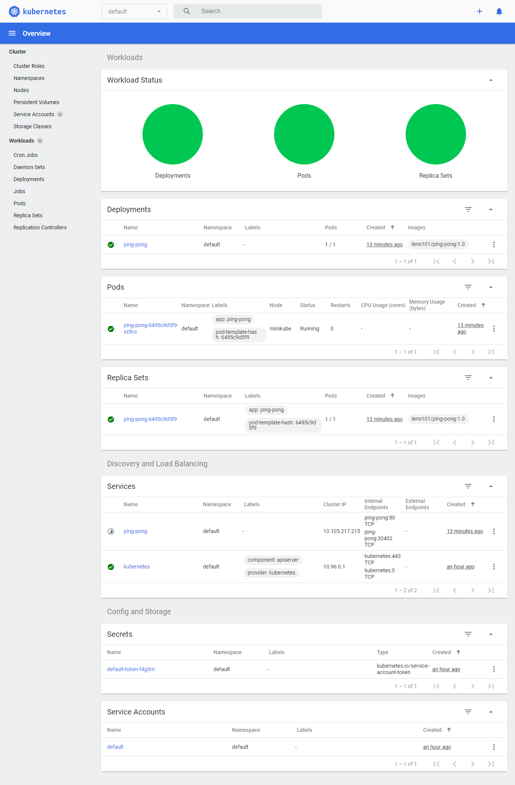

# Deployment pingpong-app built in with node js

## Dockerize
Proses dockerize menggunakan Dockerfile yang ada pada repositori ini, lalu dipush ke [Docker Hub](https://hub.docker.com/repository/docker/lemi101/ping-pong).
Modifikasi terhadap aplikasi juga dilakukan (menambah .env dan .gitignore).

## Kubernetes
Untuk deployment di kubernetes, menggunakan konfigurasi seperti pada file `pingpong.yaml`. 
Terdapat manifest untuk Deployment dan Service.
~~Proses deployment gagal dilakukan dikarenakan terdapat masalah pada minikube dikarenakan saya menggunakan environment baru, sehingga tidak dapat menyelesaikan deployment sesuai waktu yang ditentukan.~~

Proses deployment berhasil dilakukan menggunakan `minikube` dan `kubectl`. Screenshoots yang disertakan sebagai berikut:

Hasil testing menggunakan `cURL`:

Tampilan dashboard:

